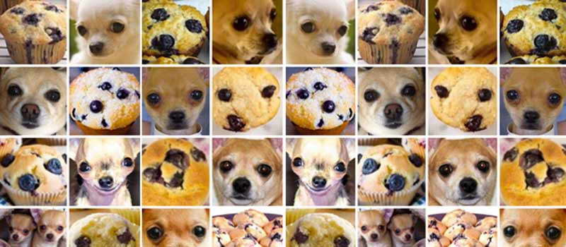

# Muffin vs. Chihuahua

## Project Description

### Problem and Origin
There is a semi popular meme about the claim that computer vision models have
difficulties distinguishing models from chihuahuas. There are even more
examples like this, for example one in which poodles look like fried chicken.
As you can see, the muffins and the dogs do in fact look similar if the photo
was taken in the right angle, and it isn't hard to imagine a computer may have
difficulties distinguishing between them.

In this project, I want to explore this meme a little and see myself
if there is any truth to it.
It is also important to know that the meme arose in 2017.
Most likely, progress in the field made it much easier for modern models to
deal with this.
Let's find out!

Also regarding the description of how the model may be used: 
Like this model isn't even useful for anything.
I cannot imagine any situation in which it may be used.
I doubt that there is a serious computer program in need of a model able to do
perform binary classification between chihuahuas and muffins in the real world.
This is more like an experiment or rather research project to explore
different computer vision model's capacities and to get to the bottom of this
meme.

### Solution, Model and Results

I fine tuned a binary image classifier in PyTorch on the muffin vs chihuahua
data set.
It's a ResNet18 convolutional network.
It is not too bad so far, but full evaluation on the test set is pending.

## Environment
To build and activate the environment, just run this:
```bash
# build the environment from environment.yaml file
conda env create -f environment.yaml

# activate the environment
conda activate muffin_vs_chihuahua
```

## Data
To download the data, just run the script `scripts/get_data.sh` in the terminal.
You can run it from any working directory, because it manages the paths.


