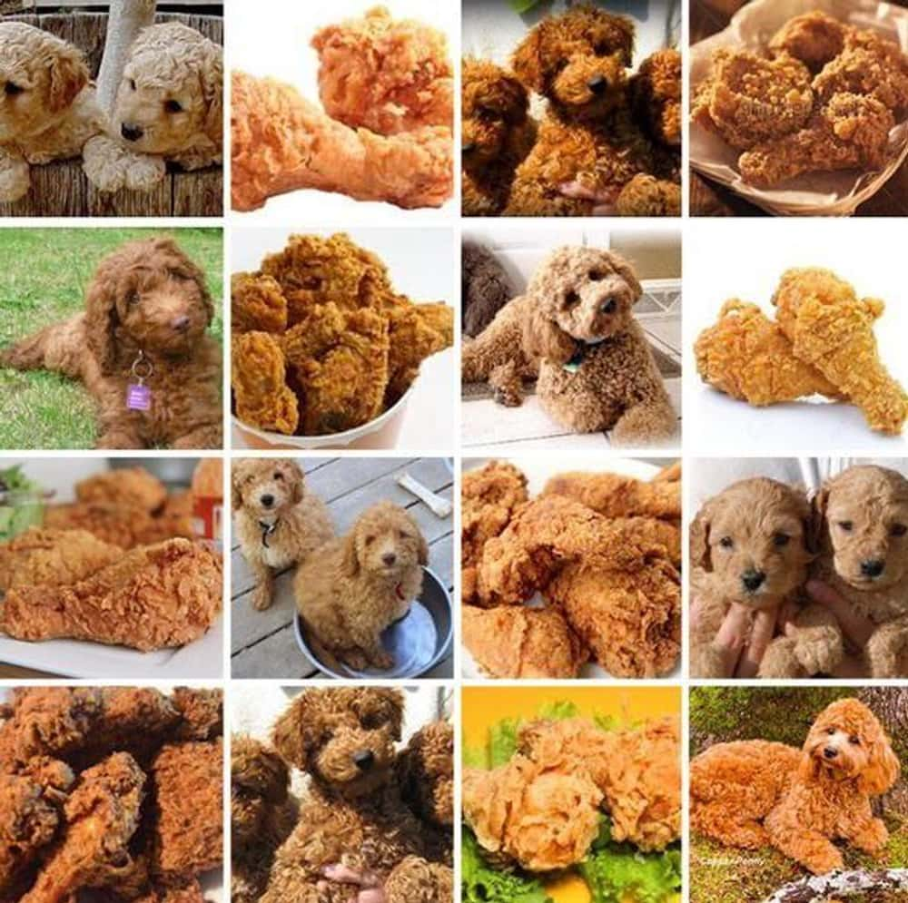
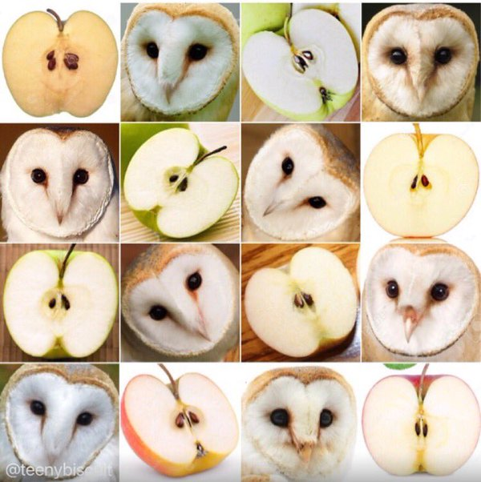
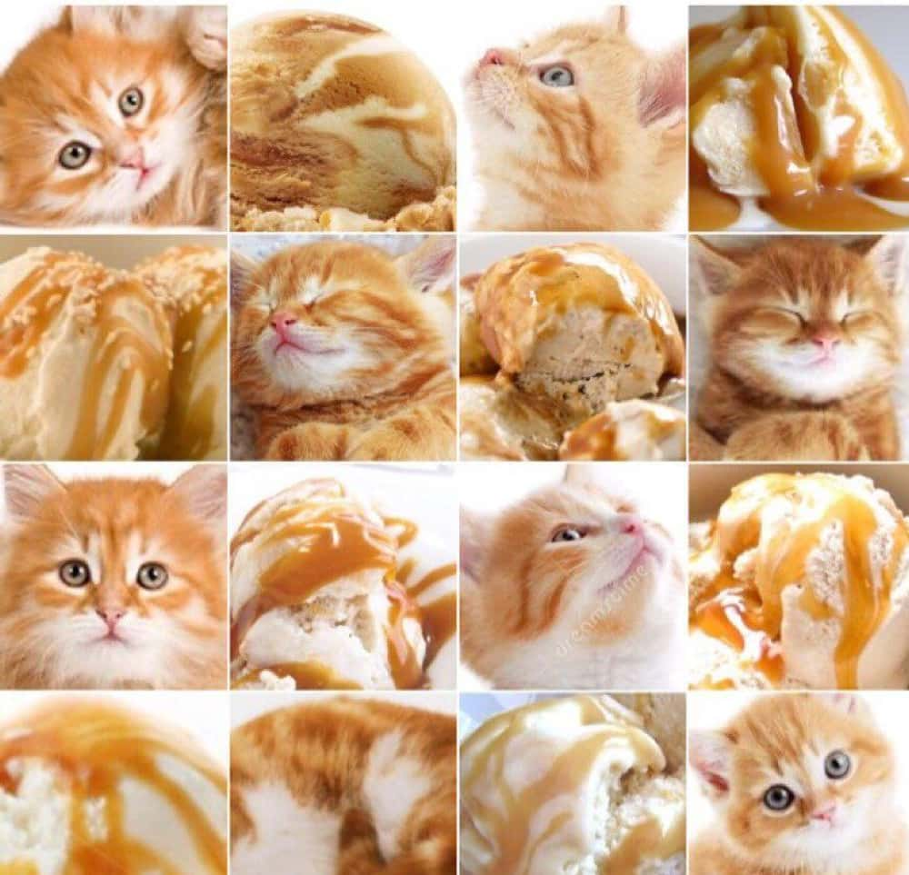
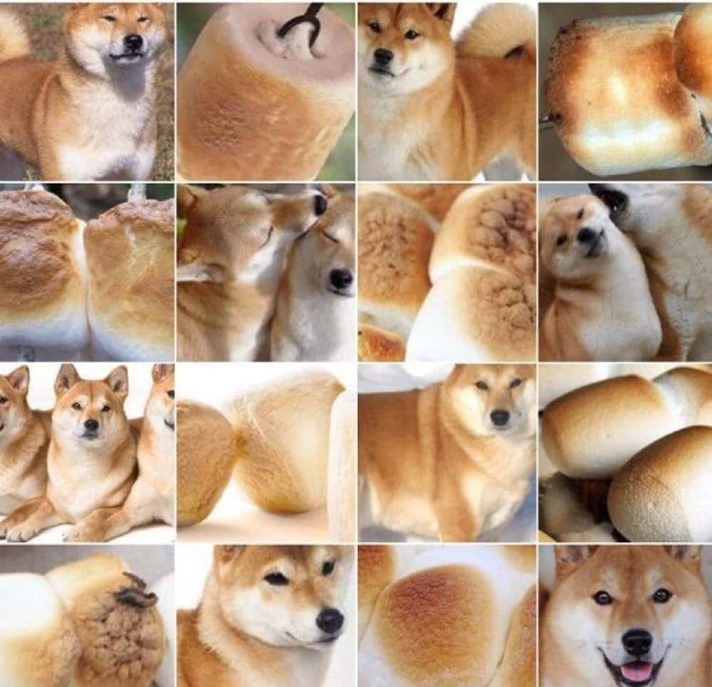
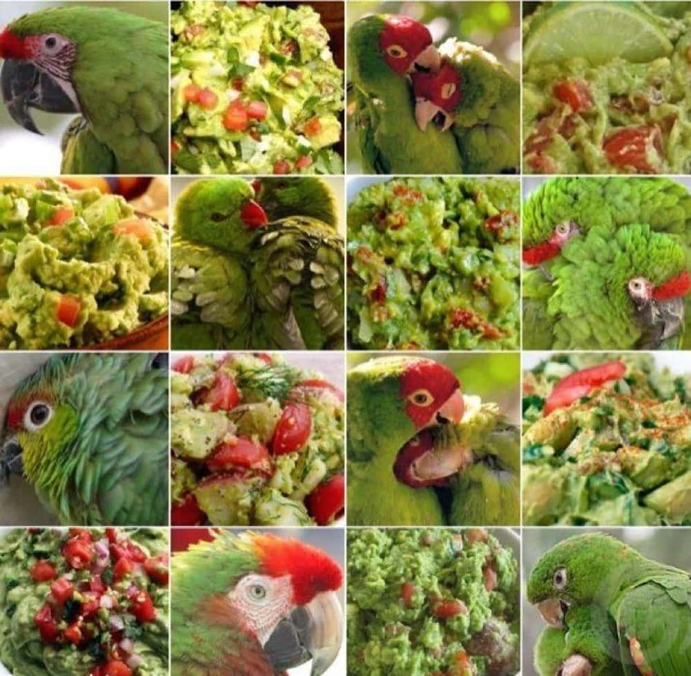
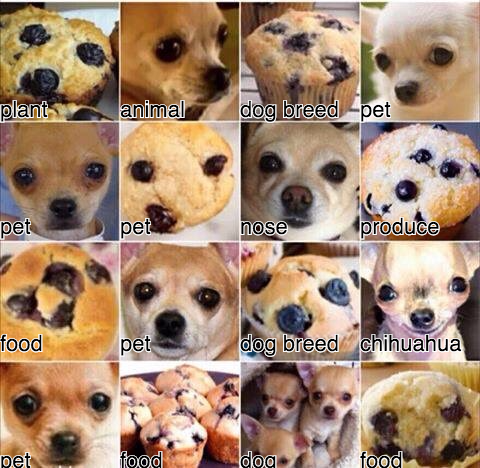

# Muffin vs. Chihuahua

## Project Description

### Problem and Origin

There is a semi popular meme about the claim that computer vision models have
difficulties distinguishing muffins from chihuahuas.

<p align="center">
  
</p>

For the first time, the [meme](https://knowyourmeme.com/memes/puppy-or-bagel)
came up in November 2015, and went viral in early 2016.

As you can see, the muffins and the dogs do in fact look similar.
If the photo was taken in the right angle, it wouldn't be hard to imagine a
computer may have difficulties distinguishing between them.
Regarding their shape, spatial arrangement, texture and color, images of these
objects can resemble each other a lot.
A computer vision model has to learn the subtle differences
of the patterns to classify them correctly.

There are even more memes like the one with the muffins and chihuahuas.
For example, this one in which poodles look like fried chicken.

<p align="center">
  
</p>

Or these ones even including different animals like kittens and birds.

<p align="center">
  <table width="52%"
  align="center"
  border="0"
  cellspacing="0"
  cellpadding="0">
    <tr>
      <td></td>
      <td></td>
    </tr>
    <tr>
      <td></td>
      <td></td>
    </tr>
  </table>
</p>

One example of an early computer vision model actually misclassifying a cookie
for a pet and a muffin for a dog breed was found when [Steren's Labs tested
Google's Cloud Vision API in 2016](https://labs.steren.fr/2016/03/27/trying-to-confuse-googles-vision-algorithms-with-dogs-and-muffins/).

<p align="center">
  
</p>

They tested multiple of the animals vs food memes and found that
"for almost each set, there is one tile that is completely wrong, but the
rest is at least in the good category."
Basically the AI is mostly correct, but there are some misclassifications, too.
Interestingly, they often align with the memes (as seen in the example).

In 2017, [TopBots tested six image classification APIs](
    https://www.topbots.com/chihuahua-muffin-searching-best-computer-vision-api/
) on this problem.
They also found most predictions to be correct.
Also here, the wrongly classified cases actually often sort of aligned with
the meme.
For example, there was a case of a muffin being classified as a dog snout.

There has even been a
[paper about benchmarking multimodal LLMs on multi panel images](
    https://aclanthology.org/2024.acl-long.370/
) in 2024 referencing the meme in its title.
They don't further discuss the problem,
but it is a good example of how the problem is known.

There is also a [preprint paper from Mongolian University of Science and
Technology and National University of Mongolia](
    https://arxiv.org/abs/1801.09573
) in 2018 about a deep learning approach to the problem.
They refer to this sort of problem as "very similar object recognition".
They used a VGG19-like network with 20 layers
containing 5 convolutional blocks followed by fully connected layers.
Each class contained only 500 images,
and they used data augmentation techniques,
Training was done using transfer learning from ImageNet weights in a two-step
process of pretraining and fine-tuning.
With this, they achieved 97%+ accuracy on the test set.
The authors themselves consider this study to have solved the problem:
> "The proposed method is fully solved the very similar object recognition like
> muffin or Chihuahua. It is the right solution for the such problem."

Based on this, it has not really been an actual challenge for AI to distinguish
between these things since at least 2016.
Even back then, the AI makes very few mistakes.
Interestingly, when it does make mistakes though, they often align with the
meme, so there still may be something to it.
In the meantime, the problem has been declared solved.

But all these solutions come from the era of cloud computing, or are developed
by companies or universities.
The question is if modern computer vision systems you can train yourself at
home on a laptop will still struggle with distinguishing muffins and chihuahuas
or if there finally is no truth to the meme anymore at all.

Some words regarding how the model may be used, because this is done as final
project *Capstone 2* for the 2024 cohort of Data Talk Club's
*Machine Learning Zoomcamp*.
In the real world, I seriously doubt that the model, which will be trained in
this project, is going to be used for anything.
I can hardly imagine a real world situation in which it may actually be useful,
or in which more general computer vision models wouldn't probably be
able to do the job well enough
and I doubt that there is a serious computer program in need of a model able to
perform binary classification between just muffins and chihuahuas.
This is more like an experiment or hobby research projec to explore
different computer vision model's capacities and to get to the bottom of this
meme.

### Solution, Model and Results

To solve this problem, I fine tuned a ResNet18 convolutional neural network
to perform binary classification between muffins and chihuahuas.
The model was pretrained on ImageNet, fine tuned on 4730 and tested on 1183
images.
The classes are 'muffin' and 'chihuahua'.
I searched for the best values for the learning rate and dropout rate, then
experimented with replacing the original fully connected layer with lightly more
complex structures.
Finally, the unmodified model with default parameters turned out to perform
best.
This once again supports the just how well rounded and versatile the
ResNet18 architecture is and how well its default parameters work are tuned.
The model was fine tuned with a learning rate of 0.001 and no dropout for 18
epochs, then early stopping triggered after seven consecutive epochs with no
improvement in validation loss.

This is the evaluation on the hold out test set:
```python
Test Loss:     0.0262
Test Accuracy: 99.07%
Test ROC AUC:  0.9996
Test F1 Score: 0.9899
```

The model is deployed with FastAPI and can be hosted locally with
Docker, from which it can be queried with HTTP requests.

## How to get the code

You can clone this repository from GitHub with this command:

```bash
git clone https://github.com/fabianjkrueger/muffin_vs_chihuahua
```

If you don't have git installed, you can get it
[here](https://git-scm.com/downloads).


## Environment

The environment is managed with conda.

To build and activate the environment, just run this:

```bash
# build the environment from environment.yaml file
conda env create -f environment.yaml

# activate the environment
conda activate muffin_vs_chihuahua
```

To build and activate the environment, you need to have a conda installation
(such as conda, miniconda, mamba or miniforge).
If you don't have a conda installation, please install one first.
I recommend [miniforge](https://github.com/conda-forge/miniforge),
because it is an open source lightweight version of conda.
The dependencies are listed in the file `environment.yaml`.

There is also a `requirements.txt` file in the `api` directory.
It is used to install the dependencies for the API within the docker container.
The dependencies there are reduced to the minimum to run the API, but they will
not be sufficient to run the training code or the notebooks.
So, please use the `environment.yaml` in conda to build and activate the
environment.

## Data

The data used for this project is from Kaggle.
It is a dataset of images of muffins and chihuahuas.
You can find it [here](https://www.kaggle.com/datasets/samuelcortinhas/muffin-vs-chihuahua-image-classification/).

### Download the Data

The data is not included in the repository when you clone it from GitHub to
save space.
If you want to run the code yourself, you have to download the data.
There are multiple ways to do this.
For example, you can download it manually from the Kaggle website.
But I made it easy for you: There is a script in the `scripts` directory that
will download the data for you.
To download the data, just run the script `scripts/get_data.sh` in your
terminal and you're done good to go.
You can run it from any working directory, because paths are managed internally.

```bash
# run the script
bash scripts/get_data.sh
```

If you use a shell other than bash, you can also run the script with
`sh` or `zsh` or whatever you use, as long as it is a POSIX compatible shell.
If you're on Windows, you can use the Windows Subsystem for Linux (WSL) to run
bash scripts.

### Process the Data

Notebook: `notebooks/exploratory_data_analysis.ipynb`

Here, the images are resized to 224x224 pixels.
This step is necessary data preparation for the downstream training.
Beyond that, the data is explored and visualized.

To run the notebook, just open it in Jupyter Lab or Jupyter Notebook and run
all cells.

## How to train the model

If you just want to use the model, you don't need to run this yourself.
For that, you can just use the API as described in the next section
or access it in the `models` directory.
If you want to reproduce the results, you can run the code in this order:

### Hyper Parameter Optimization (Optional)

Notebook: `notebooks/training.ipynb`

This notebook conducts a hyper parameter optimization.
It is not necessary for you to reproduce the results,
but it is useful for you to understand the problem and the solution.
The best hyper parameters were already determined in the notebook and
applied to the training script.
This one runs quite a while, because multiple models are trained,
so I do not recommend running it.

### Train the Final Model

Script: `scripts/train.py`

This trains the final model with the best hyperparameters determined in the
previous step and this evaluates it on the test set.

Just run it from the command line with:

```bash
# train the final model
python scripts/train.py
```

The output is logged to the terminal and the file `logs/final_model_train.log`.
The final model is saved to `models/final_model.pt`.

## Deploy the model

Here, the model is hosted as an API with FastAPI.
It can be run locally in a docker container.
While FastAPI is included in the conda environment,
Docker must be installed on your machine to run the API.
If you don't have docker installed, you can get it
[here](https://www.docker.com/get-started/).

### Run the API

To run the API, you can use the following commands:

```bash
# build the docker image
docker build -t muffin_vs_chihuahua_api .

# run the docker image
docker run -p 8000:8000 muffin_vs_chihuahua_api
```

Documentation for the API can be found [here](http://localhost:8000/docs) once
it is running.

### Query the API

The API can be queried using a client or simple HTTP requesta.
I implemented some instructions, examples and test cases for you, so you can
just host it and query it.
You can find these in the notebook `notebooks/test_api.ipynb`.
Just open that notebook and run the cells.
You will find all further information and instructions there.

# Sources

- [Know Your Meme: Puppy or Bagel Page](
    https://knowyourmeme.com/memes/puppy-or-bagel
)
- [An article about the meme going viral in 2016](
    https://www.mirror.co.uk/news/weird-news/muffins-chihuahuas-bizarre-picture-quiz-7539743
)
- [Steren's Labs tries to confuse Google's Vision algorithms with dogs and muffins](
    https://labs.steren.fr/2016/03/27/trying-to-confuse-googles-vision-algorithms-with-dogs-and-muffins/
)
- [Someone tested CloudSight API on the meme](
    https://blog.cloudsight.ai/chihuahua-or-muffin-1bdf02ec1680
)
- [TopBots tested a wide range of APIs in 2017](
    https://www.topbots.com/chihuahua-muffin-searching-best-computer-vision-api/
)
- [Muffin or Chihuahua? Challenging Multimodal Large Language Models with
Multipanel VQA](
    https://aclanthology.org/2024.acl-long.370/
)
- [Deep Learning Approach for Very Similar Objects Recognition
Application on Chihuahua and Muffin Problem](
    https://arxiv.org/abs/1801.09573
)
